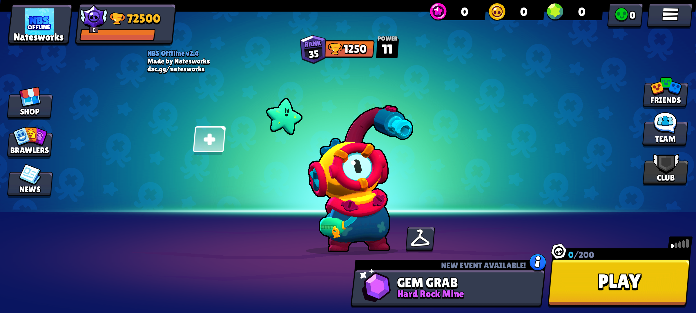
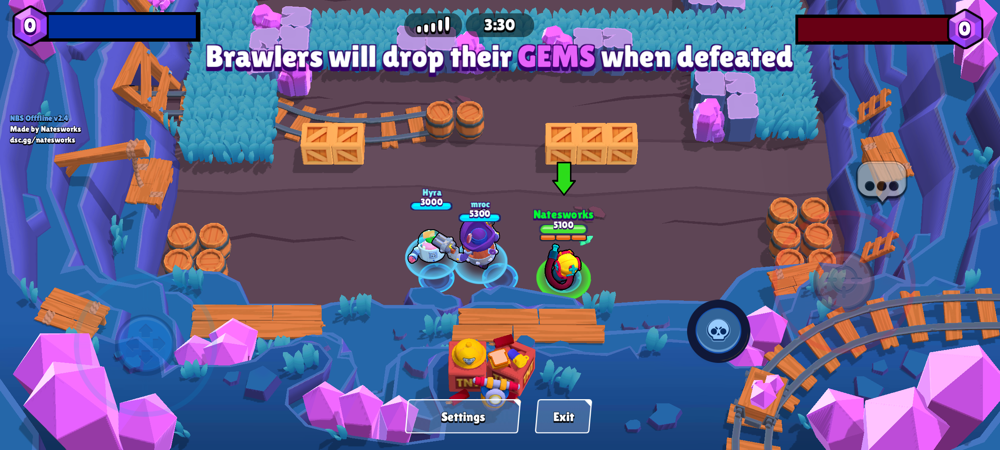
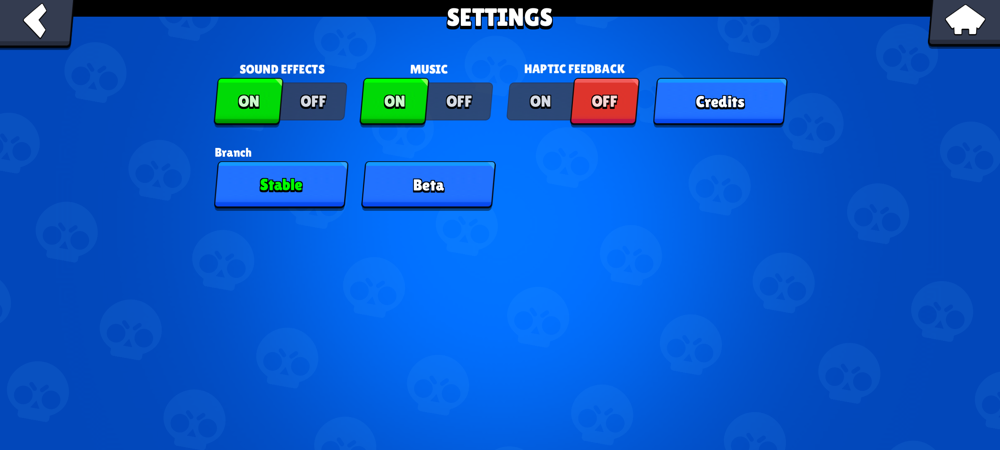

# NBS Offline V44

This is an offline client for V44 (the version that added Otis).

## Features

- Main menu
- Offline battles
- Colorfull lobby
- Disabled store and Brawl Pass
- Random bot names
- Minimal settings
- Branch selector
- Configuration file with many options

## Screenshots

## Client

[Download](https://content.natesworks.com/brawlmods/nbsoffline/nbsoffline.apk)

## Credits

💙THANKS TO💙

S.B:
- Making an amazing guide on reverse engineering/making Brawl Stars Offline (peterr.dev/re/brawl-stars-offline).
- Answering my questions when I didn't understand something.

xXCooBloyXx:
- Telling me how to get some of the required offsets for sendOfflineMessage.
- Teaching me how to view unobfuscate arxan obfuscated functions.

BSDS Client is used for killing arxan.